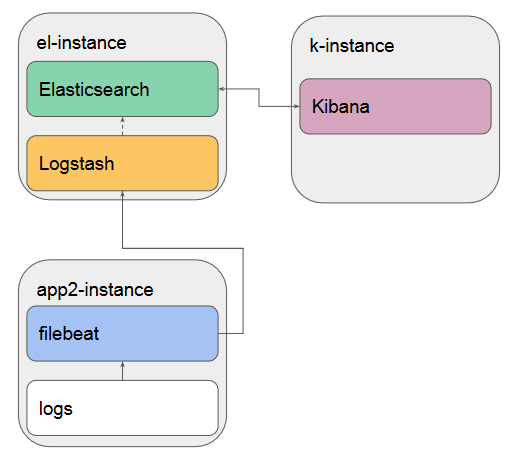

# netology-83

## Что делает playbook

Плейбук развернёт три приложения на разных хостах:

- Elasticsearch
- Kibana
- Filebeat

Схема свяхи между приложениями:



## Какие у него есть теги

- elastic
- kibana
- filebeat

## Какие у него есть параметры

- IP хостов нужно задать в файле инвентаризации [hosts.yml](inventory/prod/hosts.yml)
- Версию приложений можно задать в [all.yml](inventory/prod/group_vars/all.yml), она одинаковая для всего стека.
- Желательно задать объём памяти для JVM, для этого поправьте переменную `ES_JAVA_OPTS` в шаблоне [elasticsearch_sysconfig.j2](templates/elasticsearch_sysconfig.j2)
  
  Иначе Эластик может быть убит oom-киллером. Подробней о настройках можно прочитать по [ссылке](https://stackoverflow.com/questions/14763079/what-are-the-xms-and-xmx-parameters-when-starting-jvm).
  
- Все приложения будут установлены из RPM-пакетов.
- Вы можете поднять хосты в Яндекс.Облаке с помощью [Terraform](terraform/yandex.tf)
- Тогда для доступа на виртуальные машины будет использован Ваш публичный ключ ssh `~/.ssh/id_rsa.pub`

## Как запустить

[Краткая инструкця по работе с Яндекс.Облаком и Тераформ](https://cloud.yandex.ru/docs/tutorials/infrastructure-management/terraform-quickstart)

1. Создайте сервисный аккаунт и [токен](https://cloud.yandex.com/en-ru/docs/iam/operations/iam-token/create-for-sa#keys-create) для Яндекс.Облака, на выходе должен получтиться файл `key.json`
1. Положите его в папку [terraform](./terraform)
1. В [конфиге Terraform](terraform/yandex.tf) задайте [id облака](https://cloud.yandex.ru/docs/tutorials/infrastructure-management/terraform-quickstart#configure-provider) и [id папки](https://cloud.yandex.ru/docs/resource-manager/operations/folder/get-id) Яндекс.Облака 
1. Зайдите в папку, инициализируйте Тераформ и создайте виртуальные машины
    ```bash
    cd terraform
    terraform init
    terraform apply -auto-approve
    ```
    На выходе Вы получите внешние IP хостов, что-то вроде:
    ```ini
    public_ip = toset([
        "netology-83-elk 84.201.134.204",
        "netology-83-fb 84.252.128.131",
        "netology-83-k 84.201.131.160",
    ])
    ```
1. IP хостов нужно задать в файле инвентаризации [hosts.yml](inventory/prod/hosts.yml)
1. Запустите плейбук
    ```bash
    ansible-playbook -i inventory/prod playbook.yml
    ```
1. После завершения, зайдите в Кибану. Чтобы найти данные от Filebeat, откройте меню и выберите "Discover"

    
